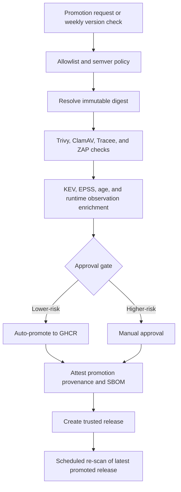

# ArtifactGate: Evidence-Based Admission Control for Third-Party Containers

[](https://github.com/llody9977/artifactgate/actions/workflows/ci.yml)
[](https://github.com/llody9977/artifactgate/actions/workflows/image-promotion.yml)
[](https://github.com/llody9977/artifactgate/actions/workflows/rescan.yml)

I built ArtifactGate around a practical problem: pulling a third-party container is easy, but accepting the supplier's risk along with it is also easy.

A familiar image name or a green vulnerability scan is useful, but neither is proof that the image came through the expected path, contains only acceptable components, or is the same set of bytes later deployed. Tags can move. SBOMs can be incomplete. New CVEs appear after release. A sidecar can also carry a separate supply-chain risk from the main application.

ArtifactGate is a personal reference implementation of an **evidence-based admission and promotion gate**. It treats a vendor image as untrusted input, resolves the exact application and runner digests, gathers security evidence, applies a documented decision policy, and promotes only the accepted pair to a controlled registry namespace. Deployment then verifies the promotion attestations and uses those same immutable digests.

The example workload is `n8nio/n8n`, but the pattern is broader: do not turn third-party software into an internally trusted artifact until you can explain what was assessed, what was accepted, and what will actually run.

> **Core idea:** trust is not inherited from a tag or created by a scanner. It is a recorded decision about an exact artifact, supported by evidence and bounded by what that evidence can prove.

## The Decision ArtifactGate Produces

ArtifactGate is designed to answer six questions before deployment:

| Question | Evidence or control |
| :--- | :--- |
| **Source** — Did this come from an allowed upstream? | source allowlist and version intake policy |
| **Identity** — Which exact bytes were assessed? | OCI digest resolution and digest pinning |
| **Composition** — What is declared to be inside? | SPDX SBOM and machine-readable OpenVEX statement generation and attestation |
| **Risk** — What security signals are known now? | vulnerability, malware, secret, licence, KEV, EPSS, age, OpenVEX and runtime observation |
| **Decision** — Why was it promoted? | policy gate or explicit, scoped, expiring waiver and cryptographically signed OpenVEX document |
| **Continuity** — Are we deploying and monitoring the same artifact? | keyless promotion attestation, verification before deployment and scheduled re-scan |

These are complementary controls. Provenance is not an SBOM, an SBOM is not a vulnerability verdict, a scan is not proof of non-exploitability, and a signature does not make unsafe content safe.

## What This Repository Does

- allowlists the upstream source image and enforces semver-style version intake
- resolves and scans immutable application and runner digests
- enriches findings with `KEV`, `EPSS`, CVE age, and bounded runtime observation
- promotes an approved application and runner pair to GHCR
- attests provenance and SBOM data for the promoted artifact
- re-scans the latest promoted release on a schedule
- provides a hardened Docker Compose deployment for n8n

## End-to-End Promotion Workflow

The promotion pipeline handles images in a strict, zero-trust workflow:

```text
[ Upstream Registry ]  --> ( Intake Gate )  --> [ Quarantine Environment ]
  n8nio/n8n:latest            |                    - Trivy Vulnerability Scan
 (Mutable Reference)          v                    - Trivy Secret & Licence Scan
                       [ Resolve Digest ]          - OWASP ZAP DAST Network Scan
                              |                    - Tracee eBPF Syscall Monitor
                              v                    
                      ( Policy Engine )  --> [ Cosign Signing & Attestations ]
                       KEV / EPSS Check          - Signed Build Provenance
                       Fail-Closed Rules         - Signed SPDX SBOM Metadata
                              |                  - Signed OpenVEX Exception Docs
                              v
                      [ GHCR Namespace ] --> ( install.sh Admission Check )
                       n8n-trusted@sha           - Verify OIDC workflow identity
                      (Immutable Digest)         - Weekly continuous re-scans
```

### Detailed Workflow Steps:

1. **Intake & Digest Pinning**: Downstream references are resolved to immutable OCI SHA256 digests for the `linux/amd64` architecture at intake. ArtifactGate currently admits only Linux AMD64 workload images to guarantee byte-level parity between scanned and deployed objects. This guarantees that the exact code evaluated during building matches the code running in production.
2. **Static Vulnerability & Threat Scan**: Trivy extracts a complete SPDX SBOM and scans container layers for secrets, licensing liabilities, and vulnerability CVE records.
3. **Dynamic Observation**: The container is executed in a quarantine test harness. **Tracee** uses kernel-level eBPF tracing to audit loaded shared libraries and system calls. **OWASP ZAP** performs a DAST baseline scan to identify web interface exposures.
4. **Policy Decision Engine**: Scans are enriched with real-time risk metrics (CISA KEV catalog active exploitation status and FIRST EPSS exploit probability). If the image violates rules in `vulnerability-gate-policy.yml` (e.g. active KEV exploits or high-risk unknown items), it fails closed. High-risk items require documented, expiring OpenVEX waivers approved in the GitHub Actions environment.
5. **OIDC Promotion & Attestation**: Approved image pairs are copied to the protected `llody9977/artifactgate/n8n-trusted` registry path. The promotion workflow generates and signs build provenance, SBOM declarations, and OpenVEX files using Cosign and OIDC-backed runner keys.
6. **Admission Verification & Re-scanning**: Workloads are deployed using their exact SHA256 digests. The `install.sh` installer runs `cosign verify` and `gh attestation verify` for both subjects before initialization, failing closed unless `--insecure-lab-mode` is configured. Deployed builds are re-scanned weekly on a cron schedule to check for post-release security decay.

## Standards-Informed Framing

ArtifactGate uses the following publications as design references. This is an engineering mapping, not a certification or claim of NIST or SLSA conformance.

| Reference | How it informs ArtifactGate |
| :--- | :--- |
| [NIST SP 800-161 Rev. 1](https://csrc.nist.gov/pubs/sp/800/161/r1/upd1/final) | Frames third-party software as a cybersecurity supply-chain risk that needs due diligence, assessment, mitigation and continuing oversight. |
| [NIST SP 800-190](https://csrc.nist.gov/pubs/sp/800/190/final) | Informs trusted-image handling, vulnerability management, registry controls and hardened container runtime configuration. |
| [NIST SP 800-218 (SSDF)](https://csrc.nist.gov/pubs/sp/800/218/final) | Informs verification of third-party components and the collection and protection of release provenance and integrity evidence. |
| [NIST SP 800-204D](https://csrc.nist.gov/pubs/sp/800/204/d/final) | Provides the closest architectural framing for integrating provenance, attestations, SBOMs and supply-chain controls into CI/CD. |
| [SLSA v1.2](https://slsa.dev/spec/v1.2/) | Supplies a useful model for provenance and verification expectations. ArtifactGate does not claim a SLSA level for an upstream image it did not build. |
| [EU CRA](https://digital-strategy.ec.europa.eu/en/policies/cyber-resilience-act) | Establishes regulatory vulnerability disclosure and machine-readable VEX requirements. |
| [NTIA SBOM Elements](https://www.ntia.doc.gov/files/ntia/publications/sbom_minimum_elements_report.pdf) | Defines minimum required transparency elements for SPDX SBOM reporting. |

NIST describes SBOMs as a way to improve transparency, provenance and the speed of vulnerability identification. ArtifactGate therefore keeps the SBOM tied to the promoted digest and feeds the inventory into ongoing risk review. It does not treat the presence of an SBOM as proof that the inventory is complete or that the artifact is secure.

## Where Trust and Rules Are Set

The rules are kept in the repository so a change is reviewable and leaves source history. The policy files state the intent; the workflow and enrichment script enforce the decision.

| Control point | Current rule | Source of truth |
| :--- | :--- | :--- |
| Trusted upstream intake | only `n8nio/n8n` and `n8nio/runners`; strict `x.y.z` versions, with `latest` resolved before use | [`policy/image-ingestion-policy.yml`](policy/image-ingestion-policy.yml) |
| Upstream signature handling | warning-only because the vendor signature is not currently available; the accepted gap and review date are recorded | [`policy/image-ingestion-policy.yml`](policy/image-ingestion-policy.yml) |
| Vulnerability gate | critical/high findings require review for KEV, age ≥30 days, EPSS ≥2%, or unknown required evidence | [`policy/vulnerability-gate-policy.yml`](policy/vulnerability-gate-policy.yml) and [`enrich_findings.py`](.github/scripts/enrich_findings.py) |
| Manual exception | `trusted-promotion` environment approval plus every gated CVE, meaningful justification, compensating controls and future expiry | [`image-promotion.yml`](.github/workflows/image-promotion.yml) |
| Trusted outputs | separate ArtifactGate GHCR repositories and attestations for the application and runner | [`signing-and-attestation.md`](docs/signing-and-attestation.md) |
| Deployment admission | verify both subjects against owner `llody9977`, then deploy both by immutable digest | [`install.sh`](iac/n8n/install.sh) |
| Continuing review | weekly re-scan of the latest promoted release, with a security issue when risk crosses the current gate | [`rescan.yml`](.github/workflows/rescan.yml) |

When adapting the pattern to another vendor, start by changing the intake allowlist through a pull request, confirming the vendor's own signature or provenance mechanism, defining risk thresholds suitable for the environment, and configuring independent reviewers for the protected promotion environment.

## Pipeline Flow



## Assurance Boundary

A successful promotion does not mean that an image is vulnerability-free, compliant, or safe for every environment. It means only that the exact image pair passed this project's documented checks, or that identified exceptions were explicitly accepted with scope, justification and an expiry date.

The GitHub OIDC attestation proves that ArtifactGate's promotion workflow handled a particular digest. It does **not** prove how the upstream vendor originally built that digest unless separately verified upstream provenance exists. Likewise, Tracee observations cover only the exercised smoke-test paths; a file that was not observed is not proven unreachable.

## Quick Start

To deploy the latest promoted image to a host:

```bash
# Clone the repository (note: formerly checkout folder named secure-ci-deploy)
git clone https://github.com/llody9977/artifactgate.git
cd artifactgate/iac/n8n
chmod +x install.sh
./install.sh
```

The install flow:

- resolves the repo and release to deploy
- requires and verifies provenance for both images using GitHub CLI
- writes a deployment `.env`
- starts n8n with external task runners
- supports rollback and optional auto-upgrade

The secure default binds n8n to localhost and expects TLS termination at the configured `PUBLIC_BASE_URL`. Use `--insecure-lab-mode` only for an isolated test environment; it disables attestation verification.

To run image promotion manually:

1. Open `Actions`
2. Select `Image Promotion (Trusted Source)`
3. Enter a version such as `2.14.2`, or leave `latest`

## Documentation

- [Architecture and trust model](docs/architecture-and-trust.md)
- [Approval gate policy](docs/gate-policy.md)
- [Signing and attestation](docs/signing-and-attestation.md)
- [Deployment and operations](docs/deployment-and-operations.md)

## Repository Structure

```text
.
├── .github/workflows/
├── .github/scripts/
├── docs/
├── iac/n8n/
└── policy/
```

## Key Paths

- [image-promotion.yml](https://github.com/llody9977/artifactgate/blob/main/.github/workflows/image-promotion.yml)
- [rescan.yml](https://github.com/llody9977/artifactgate/blob/main/.github/workflows/rescan.yml)
- [docker-compose.yml](https://github.com/llody9977/artifactgate/blob/main/iac/n8n/docker-compose.yml)
- [install.sh](https://github.com/llody9977/artifactgate/blob/main/iac/n8n/install.sh)
- [upgrade.sh](https://github.com/llody9977/artifactgate/blob/main/iac/n8n/upgrade.sh)

## References

- [OWASP Top 10 CI/CD Security Risks](https://owasp.org/www-project-top-10-ci-cd-security-risks/)
- [NIST SP 800-161 Rev. 1](https://csrc.nist.gov/pubs/sp/800/161/r1/upd1/final)
- [NIST SP 800-190](https://csrc.nist.gov/pubs/sp/800/190/final)
- [NIST SP 800-218](https://csrc.nist.gov/pubs/sp/800/218/final)
- [NIST SP 800-204D](https://csrc.nist.gov/pubs/sp/800/204/d/final)
- [NIST software supply-chain SBOM guidance](https://www.nist.gov/itl/executive-order-14028-improving-nations-cybersecurity/software-supply-chain-security-guidance-20)
- [SLSA v1.2 specification](https://slsa.dev/spec/v1.2/)
- [CISA KEV](https://www.cisa.gov/known-exploited-vulnerabilities-catalog)
- [FIRST EPSS](https://www.first.org/epss/)
- [CIS Docker Benchmark](https://www.cisecurity.org/benchmark/docker)

## Disclaimer

ArtifactGate is a personal, experimental reference implementation provided for general information and learning. It is not security, legal, compliance or risk-management advice, and it does not certify that an image, deployment or upstream publisher is secure.

Scan and enrichment results may be incomplete, delayed, revised or incorrect. Runtime observations cover only the exercised test paths. A promoted image may still contain exploitable vulnerabilities or become vulnerable later. Review the source, policies, scan evidence, exceptions and deployment configuration against your own environment. The project is provided “as is”, without guarantees. Use it at your own risk.

n8n and other product names and trademarks belong to their respective owners. This project is not affiliated with, endorsed by or certified by n8n, CIS, CISA, NIST, OWASP, Sigstore, Aqua Security or GitHub.

## Licence, attribution and signing

ArtifactGate is released under the [Apache License 2.0](LICENSE). Redistributions must retain the applicable notices, including [NOTICE](NOTICE). See [AUTHORS.md](AUTHORS.md) for authorship and AI-assistance disclosure.

Maintainer commits and tags use a local SSH signing identity. Published container evidence uses GitHub's OIDC-backed, keyless artifact attestations; the personal SSH private key is never copied into GitHub Actions. These identities serve different trust purposes and are verified separately.

I maintain this as a personal project, so there is no fixed support or service timetable. See [CONTRIBUTING.md](CONTRIBUTING.md) and [SECURITY.md](SECURITY.md) before reporting or changing security-sensitive behaviour.
