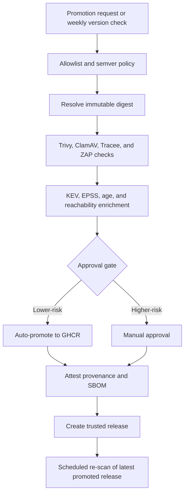

# ArtifactGate: Trusted Vendor Image Promotion for n8n

[](https://github.com/llody9977/artifactgate/actions/workflows/ci.yml)
[](https://github.com/llody9977/artifactgate/actions/workflows/image-promotion.yml)
[](https://github.com/llody9977/artifactgate/actions/workflows/rescan.yml)

I built ArtifactGate as a personal reference project to work through a practical question: if I need to run a third-party container image, what evidence should I collect before treating it as deployable?

The example uses n8n. The pipeline resolves the application and external runner to immutable digests, scans and enriches the findings, records the promotion decision, publishes the accepted pair to GHCR, and provides a hardened deployment example.

The example workload is `n8nio/n8n`. The same pattern is meant to demonstrate how a vendor image can be evaluated as a trust and decision problem, not only as a raw CVE count.

## What This Repo Does

- allowlists the upstream source image and enforces semver-style version intake
- resolves and scans an immutable upstream digest
- enriches findings with `KEV`, `EPSS`, CVE age, and runtime reachability context
- promotes an approved application and runner pair to GHCR
- attests provenance and SBOM data for the promoted artifact
- re-scans the latest promoted release on a schedule
- provides a hardened Docker Compose deployment for n8n

## Pipeline Flow



## Assurance boundary

A successful promotion does not mean that an image is vulnerability-free. It means only that the image pair passed the project's documented checks, or that identified exceptions were explicitly reviewed with an expiry date. Tracee observations cover the exercised smoke-test paths; a file that was not observed is not proven unreachable.

## Quick Start

To deploy the latest promoted image to a host:

```bash
git clone https://github.com/llody9977/artifactgate.git
cd artifactgate/iac/n8n
chmod +x install.sh
./install.sh
```

The install flow:

- resolves the repo and release to deploy
- requires and verifies provenance for both images using GitHub CLI
- writes a deployment `.env`
- starts n8n with external task runners
- supports rollback and optional auto-upgrade

The secure default binds n8n to localhost and expects TLS termination at the configured `PUBLIC_BASE_URL`. Use `--insecure-lab-mode` only for an isolated test environment; it disables attestation verification.

To run image promotion manually:

1. Open `Actions`
2. Select `Image Promotion (Trusted Source)`
3. Enter a version such as `2.14.2`, or leave `latest`

## Documentation

- [Architecture and trust model](docs/architecture-and-trust.md)
- [Approval gate policy](docs/gate-policy.md)
- [Deployment and operations](docs/deployment-and-operations.md)

## Repository Structure

```text
.
├── .github/workflows/
├── .github/scripts/
├── docs/
├── iac/n8n/
└── policy/
```

## Key Paths

- [image-promotion.yml](https://github.com/llody9977/artifactgate/blob/main/.github/workflows/image-promotion.yml)
- [rescan.yml](https://github.com/llody9977/artifactgate/blob/main/.github/workflows/rescan.yml)
- [docker-compose.yml](https://github.com/llody9977/artifactgate/blob/main/iac/n8n/docker-compose.yml)
- [install.sh](https://github.com/llody9977/artifactgate/blob/main/iac/n8n/install.sh)
- [upgrade.sh](https://github.com/llody9977/artifactgate/blob/main/iac/n8n/upgrade.sh)

## References

- [OWASP Top 10 CI/CD Security Risks](https://owasp.org/www-project-top-10-ci-cd-security-risks/)
- [NIST SP 800-53 Rev. 5](https://csrc.nist.gov/pubs/sp/800/53/r5/upd1/final)
- [NIST SP 800-204D](https://csrc.nist.gov/pubs/sp/800/204/d/final)
- [SLSA v1.0 specification](https://slsa.dev/spec/v1.0/)
- [CISA KEV](https://www.cisa.gov/known-exploited-vulnerabilities-catalog)
- [FIRST EPSS](https://www.first.org/epss/)
- [CIS Docker Benchmark](https://www.cisecurity.org/benchmark/docker)

## Disclaimer

ArtifactGate is a personal, experimental reference implementation provided for general information and learning. It is not security, legal, compliance or risk-management advice, and it does not certify that an image, deployment or upstream publisher is secure.

Scan and enrichment results may be incomplete, delayed, revised or incorrect. Runtime observations cover only the exercised test paths. A promoted image may still contain exploitable vulnerabilities or become vulnerable later. Review the source, policies, scan evidence, exceptions and deployment configuration against your own environment. The project is provided “as is”, without guarantees. Use it at your own risk.

n8n and other product names and trademarks belong to their respective owners. This project is not affiliated with, endorsed by or certified by n8n, CIS, CISA, NIST, OWASP, Sigstore, Aqua Security or GitHub.

## Licence, attribution and signing

ArtifactGate is released under the [Apache License 2.0](LICENSE). Redistributions must retain the applicable notices, including [NOTICE](NOTICE). See [AUTHORS.md](AUTHORS.md) for authorship and AI-assistance disclosure.

Maintainer commits and tags use the same local SSH signing identity configured for VulnSignal. Published container evidence uses GitHub's OIDC-backed, keyless artifact attestations; the personal SSH private key is never copied into GitHub Actions. These identities serve different trust purposes and are verified separately.

I maintain this as a personal project, so there is no fixed support or service timetable. See [CONTRIBUTING.md](CONTRIBUTING.md) and [SECURITY.md](SECURITY.md) before reporting or changing security-sensitive behaviour.
