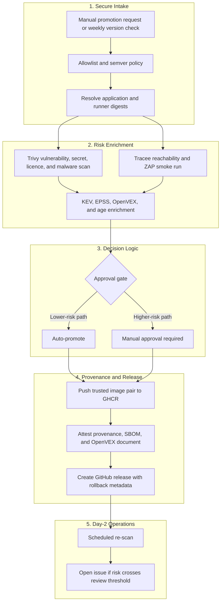

# Architecture and Trust Model

## Purpose

This repository is designed to reduce the risk of promoting a third-party image directly from an upstream registry into an environment you operate. It focuses on image trust, approval quality, and blast-radius reduction after deployment.

The example image is `n8nio/n8n`, but the architecture is meant to illustrate a broader vendor-image promotion pattern.

## Trust States

ArtifactGate uses “trusted” as a local policy state, not as a statement that the
vendor or container is universally secure.

1. **Upstream candidate** — an allowed vendor reference that has not yet earned a
   deployment decision. A moving label such as `latest` is resolved to a semantic
   version and then to immutable application and runner digests.
2. **Assessed pair** — the exact digests have composition, vulnerability, malware,
   secret, licence and bounded runtime evidence attached. This evidence can still
   contain unknowns and findings.
3. **Promoted pair** — policy allowed the assessed pair, or an accountable reviewer
   accepted every gated finding through a scoped and expiring exception. Both images
   are copied to the controlled ArtifactGate GHCR namespaces and attested separately.
4. **Admitted deployment** — the installer verifies both promotion attestations and
   deploys the same immutable digests. Scheduled re-scanning can later challenge the
   earlier decision as risk information changes.

This separation matters because controls answer different questions. The upstream
digest establishes byte identity; the SBOM describes known composition; scanning and
enrichment support a risk decision; the ArtifactGate attestation records the promotion
path; and runtime hardening limits impact. None is a substitute for the others.

## Threat Model Mapping

| Threat pattern | Why it matters here | Primary control in this repo |
| :--- | :--- | :--- |
| Dependency chain abuse | A trusted vendor image can still introduce risky or newly vulnerable components | digest pinning, Trivy scan, KEV/EPSS/age enrichment |
| Artifact substitution or tag drift | A mutable upstream tag can change without notice | resolve and pin immutable digest before promotion |
| Prohibitive licences | Vendor images may introduce strict copyleft licences | Trivy licence reporting for human review |
| Runtime misconfigurations | Static scans miss exposed runtime HTTP flaws | OWASP ZAP baseline DAST during smoke run |
| IaC and script weaknesses | Deployment files can undermine otherwise good image controls | Checkov and Shellcheck in CI |
| Insufficient flow control | Higher-risk images should not move through the same path as cleaner ones | manual approval via `trusted-promotion` |
| Weak artifact integrity evidence | Teams need proof, not only a passing scan | provenance, SBOM, and machine-readable OpenVEX attestation |
| Weak pipeline identity model | Long-lived publish credentials expand exposure | ephemeral `GITHUB_TOKEN` and OIDC-backed attestation |
| Insufficient day-2 monitoring | Risk changes after promotion | scheduled re-scan of the latest promoted release |
| Runtime over-privilege | A compromised workload can still do damage after deploy | hardened Docker runtime settings |

## Pipeline Architecture

## Identity, Trust, and Attestation

Current trust model:

- GHCR authentication uses the repository-scoped ephemeral `GITHUB_TOKEN`
- attestation flows use GitHub Actions OIDC with `id-token: write`
- build provenance, SBOM, and OpenVEX attestations are attached independently to both promoted images
- maintainer commits and tags use a local SSH signing identity; this personal key is not stored in Actions
- workflows are pinned to immutable action SHAs

In practical terms, the promotion path avoids a long-lived registry password or PAT for normal publish operations and treats the GitHub Actions workflow as the controlled promotion environment for this repository.

## Framework Alignment

These frameworks are used as design references, not blanket compliance claims.

### NIST SP 800-161 Rev. 1

Useful here for treating acquired third-party software as a continuing cybersecurity
supply-chain risk rather than a one-time download decision.

Examples in this repo:

- explicit supplier and image intake rules
- documented risk acceptance and review dates
- evidence retained with the promotion decision
- scheduled re-assessment after acquisition

### NIST SP 800-190

Useful here for container-specific image trust, vulnerability management, registry
control and runtime configuration.

Examples in this repo:

- controlled promotion namespace
- immutable image references
- pre-promotion and recurring vulnerability assessment
- least-privilege Compose configuration

### NIST SP 800-218 (SSDF)

Useful here for third-party component verification and collecting provenance data for
release components. ArtifactGate is a consumer and promoter of the example vendor image;
it does not claim to implement the vendor's development lifecycle.

### OWASP Top 10 CI/CD Security Risks

Useful here for framing the pipeline as an attack surface instead of only a delivery mechanism.

Examples in this repo:

- workflow separation
- manual approval for higher-risk paths
- digest pinning
- artifact evidence and release traceability

### NIST SP 800-53

Useful here for the control vocabulary behind access control, integrity, auditability, and least privilege.

Examples in this repo:

- policy-as-code
- approval gates
- audit-friendly release evidence
- hardened runtime defaults

### NIST SP 800-204D

Useful here for understanding how supply-chain controls fit into a DevSecOps pipeline.

Examples in this repo:

- policy-driven intake
- artifact-centric promotion decisions
- ongoing re-scan of the active promoted release

### SLSA

Useful here for reasoning about provenance, artifact integrity, and promotion trust.

Examples in this repo:

- immutable digest pinning
- provenance attestation
- SBOM attestation
- release evidence tied to the promoted image digest

## Docker Hardening

Supply-chain controls answer "can I trust this artifact?" Runtime hardening answers "if the workload is compromised, how much damage can it do?"

This repository reduces runtime blast radius by:

- dropping capabilities with `cap_drop: ALL`
- enabling `no-new-privileges`
- using a read-only root filesystem where practical
- preferring non-root execution
- constraining CPU, memory, and process counts
- applying AppArmor and related runtime restrictions

Docker hardening complements the promotion pipeline. It does not replace supply-chain integrity evidence.
