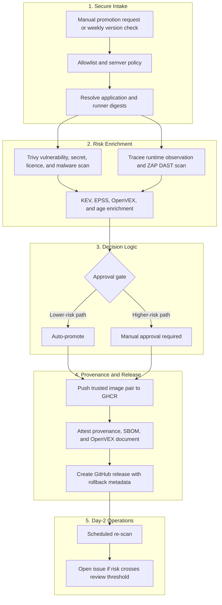

# Architecture and Trust Model

## Purpose

This repository is designed to reduce the risk of promoting a third-party image directly from an upstream registry into an environment you operate. It focuses on image trust, approval quality, and blast-radius reduction after deployment.

The example image is `n8nio/n8n`, but the architecture is meant to illustrate a broader vendor-image promotion pattern.

## Trust States

ArtifactGate uses “trusted” as a local policy state, not as a statement that the
vendor or container is universally secure.

1. **Upstream candidate** — an allowed vendor reference that has not yet earned a
   deployment decision. A moving label such as `latest` is resolved to a semantic
   version and then to immutable application and runner digests for the `linux/amd64` architecture. ArtifactGate currently admits only Linux AMD64 workload images to guarantee byte-level parity between scanned and deployed objects.
2. **Assessed pair** — the exact digests have composition, vulnerability, malware,
   secret, licence and bounded runtime evidence attached. This evidence can still
   contain unknowns and findings.
3. **Promoted pair** — policy allowed the assessed pair, or an accountable reviewer
   accepted every gated finding through a scoped and expiring exception. Both images
   are copied to the controlled ArtifactGate GHCR namespaces and attested separately.
4. **Admitted deployment** — the installer verifies both promotion attestations and
   deploys the same immutable digests. Scheduled re-scanning can later challenge the
   earlier decision as risk information changes.

This separation matters because controls answer different questions. The upstream
digest establishes byte identity; the SBOM describes known composition; scanning and
enrichment support a risk decision; the ArtifactGate attestation records the promotion
path; and runtime hardening limits impact. None is a substitute for the others.

## Control Inventory and Threat Mapping

The following table maps the specific security controls implemented in this repository to the risks they address, their execution context, enforcement behavior, and alignment with industry standards.

| Control / Verification | Risk Addressed | Function | Control Point | Enforcement | Source File | Standards Mapping |
| :--- | :--- | :--- | :--- | :--- | :--- | :--- |
| **Source Ingestion Allowlist** | Rogue tag intake & untrusted vendors | Preventive | Intake | **Blocking** | [`image-ingestion-policy.yml`](/policy/image-ingestion-policy.yml) | OWASP CICD-SEC-3 NIST SSDF PO.1.3, PW.4.1 NIST SP 800-53 SR-3 |
| **OCI Digest Resolution** | Tag drift & tag poisoning | Preventive | Intake | **Blocking** | [`image-promotion.yml`](/.github/workflows/image-promotion.yml) | OWASP CICD-SEC-3 NIST SSDF PW.4.4 NIST SP 800-53 SR-11 / CM-14 |
| **Trivy Malware Scan** | Malware injection in vendor layers | Detective | Promotion Gate | **Blocking** | [`image-promotion.yml`](/.github/workflows/image-promotion.yml#L189) | OWASP CICD-SEC-3 NIST SSDF PW.4.1 NIST SP 800-53 SR-3 |
| **Trivy Secret Scan** | Embedded credentials & API keys | Preventive | Promotion Gate | **Blocking** | [`image-promotion.yml`](/.github/workflows/image-promotion.yml#L179) | OWASP CICD-SEC-3 NIST SSDF PW.4.1 NIST SP 800-53 SR-3 |
| **Trivy Licence Scan** | Copyleft licence liabilities | Detective | Promotion Gate | Advisory | [`image-promotion.yml`](/.github/workflows/image-promotion.yml#L202) | OWASP CICD-SEC-3 NIST SSDF PO.3.2 NIST SP 800-53 SR-3 |
| **OWASP ZAP DAST Scan** | Runtime HTTP flaws & misconfigurations | Preventive | Promotion Gate | **Blocking** | [`run_tracee_reachability.sh`](/.github/scripts/run_tracee_reachability.sh#L77-L85) | OWASP CICD-SEC-3 NIST SSDF RV.1.1 NIST SP 800-53 SR-3 |
| **Tracee eBPF Observation** | Socially engineered logic bombs & call-graph loading | Detective | Promotion Gate | **Blocking** (Gated on `RuntimeObserved` / Coverage) | [`merge_tracee_reachability.py`](/.github/scripts/merge_tracee_reachability.py) | OWASP CICD-SEC-3 NIST SSDF RV.1.3 NIST SP 800-53 SR-11 |
| **Age, KEV & EPSS Enrichment** | Active CVE exploitation & zero-days | Preventive | Promotion Gate | **Blocking** | [`enrich_findings.py`](/.github/scripts/enrich_findings.py) | OWASP CICD-SEC-3 NIST SSDF RV.1.1 NIST SP 800-53 SR-3 |
| **Waiver Expiry Enforcement** | Waiver & Exception decay | Preventive | Exception / Waiver | **Blocking** | [`image-promotion.yml`](/.github/workflows/image-promotion.yml) | OWASP CICD-SEC-1 NIST SSDF PW.4.1 NIST SP 800-53 SR-3 |
| **GitHub Actions SHA Pinning** | Third-party action dependency hijacking | Preventive | Build / Pipeline | **Blocking** | All workflow manifests | OWASP CICD-SEC-3 NIST SSDF PW.4.4 NIST SP 800-53 SR-3 |
| **Scoped Token Permissions** | CI runner takeover & token theft | Preventive | Build / Pipeline | **Blocking** | Workflow permissions blocks | OWASP CICD-SEC-6 NIST SSDF PW.4.1 NIST SP 800-53 SR-3 |
| **OIDC Provenance & SBOM Attestation** | Namespace compromise & image swapping | Preventive | Attestation / Deploy | **Blocking** | [`install.sh`](/iac/n8n/install.sh) | OWASP CICD-SEC-3 NIST SSDF PW.4.4 NIST SP 800-53 SR-4 / CM-14 |
| **Checkov & ShellCheck** | IaC misconfiguration & privilege escalation | Preventive | Build (PR Merge) | **Blocking** | [`ci.yml`](/.github/workflows/ci.yml) | OWASP CICD-SEC-1 NIST SSDF PW.4.1 NIST SP 800-53 SR-3 |
| **CodeQL Scan** | Local code vulnerabilities | Detective | Build (PR Merge) | **Blocking** | [`codeql.yml`](/.github/workflows/codeql.yml) | OWASP CICD-SEC-1 NIST SSDF PW.4.1 NIST SP 800-53 SR-3 |
| **Scheduled Re-Scanning** | Post-promotion security decay | Corrective | Continuous | **Blocking** (Opens Issues) | [`rescan.yml`](/.github/workflows/rescan.yml) | OWASP CICD-SEC-9 NIST SSDF RV.1.1 NIST SP 800-53 SR-11 |

## Pipeline Architecture

## Identity, Trust, and Attestation

Current trust model:

- GHCR authentication uses the repository-scoped ephemeral `GITHUB_TOKEN`
- attestation flows use GitHub Actions OIDC with `id-token: write`
- build provenance, SBOM, and OpenVEX attestations are attached independently to both promoted images
- maintainer commits and tags use a local SSH signing identity; this personal key is not stored in Actions
- workflows are pinned to immutable action SHAs

In practical terms, the promotion path avoids a long-lived registry password or PAT for normal publish operations and treats the GitHub Actions workflow as the controlled promotion environment for this repository.

## Framework Alignment

These frameworks are used as design references, not blanket compliance claims.

### NIST SP 800-161 Rev. 1

Useful here for treating acquired third-party software as a continuing cybersecurity
supply-chain risk rather than a one-time download decision.

Examples in this repo:

- explicit supplier and image intake rules
- documented risk acceptance and review dates
- evidence retained with the promotion decision
- scheduled re-assessment after acquisition

### NIST SP 800-190

Useful here for container-specific image trust, vulnerability management, registry
control and runtime configuration.

Examples in this repo:

- controlled promotion namespace
- immutable image references
- pre-promotion and recurring vulnerability assessment
- least-privilege Compose configuration

### NIST SP 800-218 (SSDF)

Useful here for third-party component verification and collecting provenance data for release components. ArtifactGate aligns with specific practices for the consumer/promoter phase:
- **PO.1.3 & PW.4.1**: Specifying and validating third-party software components (Source allowlists, Trivy malware/secret/vulnerability checks).
- **PO.3.2**: Evaluating licensing risk (Trivy licence reporting).
- **PW.4.4**: Verifying the integrity of acquired software (Digest pinning, OIDC provenance verification).
- **RV.1.1 & RV.1.3**: Bounded runtime observation and vulnerability checking (Tracee eBPF monitoring, OWASP ZAP DAST scans).

### OWASP Top 10 CI/CD Security Risks

Useful here for framing the pipeline as an attack surface instead of only a delivery mechanism.
- **CICD-SEC-1 (PPE)**: Defended via branch protections and required code review on workflows and policies.
- **CICD-SEC-3 (Dependency Chain Abuse)**: Prevented via digest pinning, Trivy scanning, and Actions commit SHA pinning.
- **CICD-SEC-6 (Insufficient Credential Hygiene)**: Mitigated by using ephemeral GitHub OIDC tokens instead of static credentials.
- **CICD-SEC-9 (Inadequate System Monitoring)**: Addressed via weekly scheduled re-scans of promoted container digests.

### NIST SP 800-53

Useful here for specifying supply-chain and component controls:
- **SR-3 (Supply Chain Controls)**: Intake allowed list and Trivy scanners for secrets, malware, and CVEs.
- **SR-4 (Provenance)**: Ephemeral Actions OIDC provenance signing.
- **SR-11 (Component Authenticity)**: Enforced via cryptographic verification of build-time OIDC attestations at deploy.
- **CM-14 (Signed Components)**: Verification of container image signatures and machine-readable OpenVEX documents.

### NIST SP 800-204D

Useful here for understanding how supply-chain controls fit into a DevSecOps pipeline:
- Policy-driven intake rules and gates.
- Artifact-centric promotion decisions.
- Ongoing re-scan of active promoted releases.

### SLSA (Supply-chain Levels for Software Artifacts)

ArtifactGate's promotion provenance exhibits **SLSA Build L2/L3 properties** for the promotion step (hosted, ephemeral build platform with OIDC identities). It makes no SLSA claim about the upstream vendor's original build, which it did not perform and cannot verify.

### EU Cyber Resilience Act (CRA) & NTIA Minimum Elements

Useful here for ensuring compliance with emerging digital supply chain regulations:
- **[NTIA Minimum Elements for an SBOM](https://www.ntia.doc.gov/files/ntia/publications/sbom_minimum_elements_report.pdf)**: Enforced via Trivy-generated SPDX SBOMs containing component details, dependencies, and relationship links.
- **[EU Cyber Resilience Act (CRA)](https://digital-strategy.ec.europa.eu/en/policies/cyber-resilience-act) / Vulnerability Disclosure and VEX**: ArtifactGate generates machine-readable **[OpenVEX](https://openvex.dev/)** documents mapping to vulnerability scanning data, establishing an automated mechanism to declare product vulnerability status.

## Docker Hardening

Supply-chain controls answer "can I trust this artifact?" Runtime hardening answers "if the workload is compromised, how much damage can it do?"

This repository reduces runtime blast radius by:

- dropping capabilities with `cap_drop: ALL`
- enabling `no-new-privileges`
- using a read-only root filesystem where practical
- preferring non-root execution
- constraining CPU, memory, and process counts
- applying AppArmor and related runtime restrictions

Docker hardening complements the promotion pipeline. It does not replace supply-chain integrity evidence.
